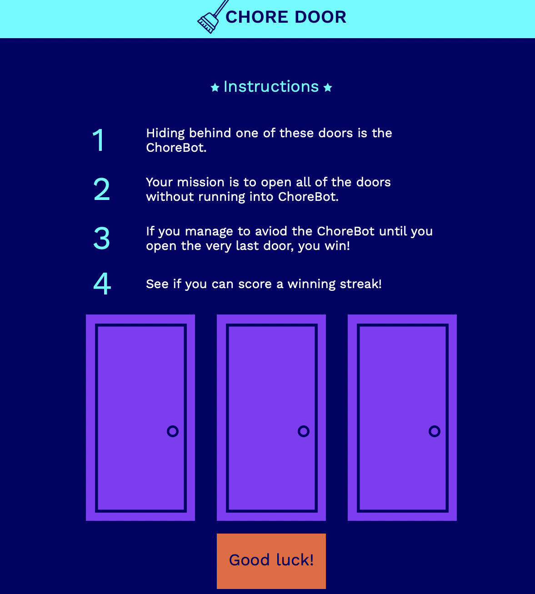
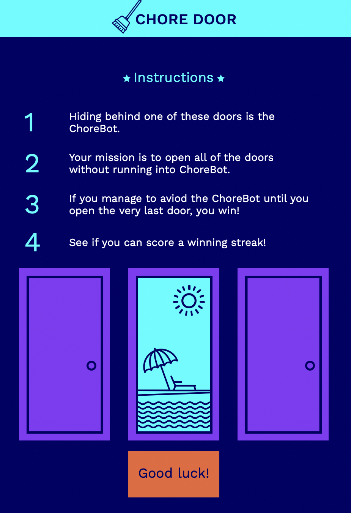
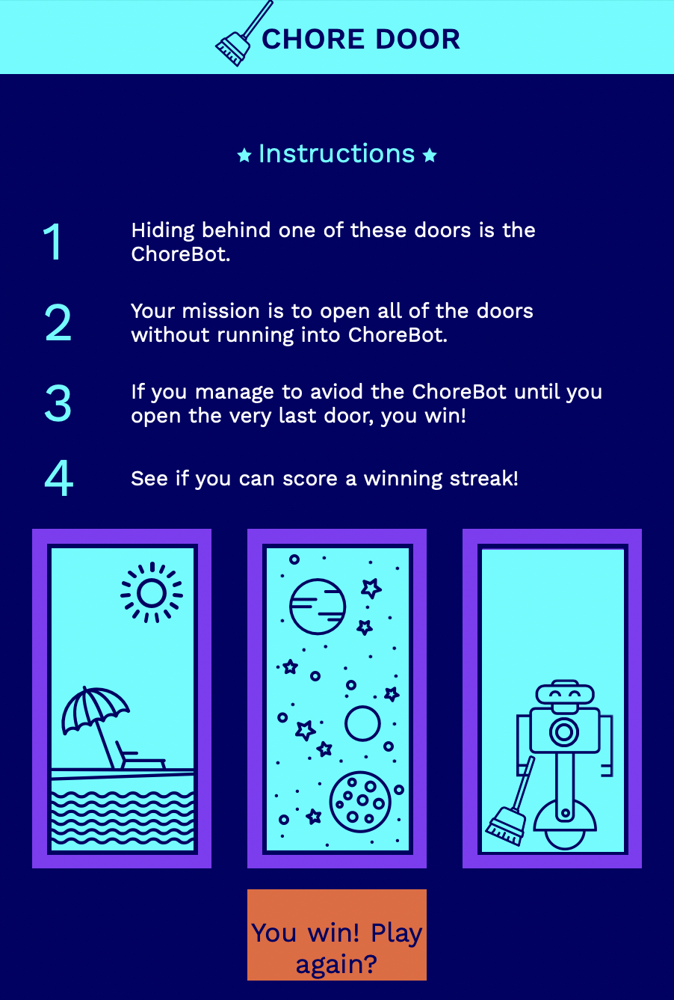
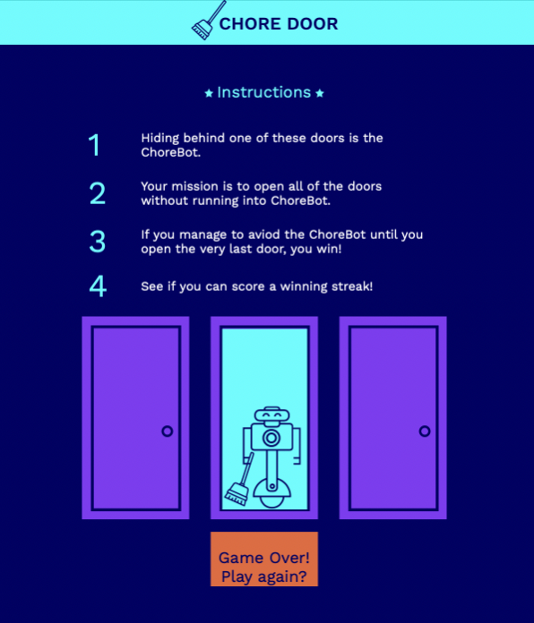

# Chorebot, an interactive game
A single-page website that plays an interactive game. Using HTML, CSS, JAVASCRIPT and GIT to produce a dynamic webpage. 
*** 

## Table of Contents 
* [General Info](#general-info) 
* [Technologies used](#technology) 
* [Screenshots](#screenshots)
* [Project Status](#project-status) 
* [Room for Improvment](#room-for-improvement) 
* [Acknowledgements](#acknowledgements)
* [Contact](#contact)
***

## General Information 
A single-page website that plays an interactive game. 
Using HTML, CSS, JAVASCRIPT and GIT to produce a dynamic webpage. 
The aim of the game is to open the three doors. Don't reveal chorebot until the last door. 
The game will record winning steaks and display the users best streak. 
***

## Technologies used
* HTML
* CSS
* JAVASCRIPT 
* Git 
* Github 
* Markdown
***

## Screenshots 
This is the Starting game play: 

This is a screenshot of game play:

This is Winning the game: 

This is losing the game: 

*** 

## Project Status 
Current Status: `Basic gameplay completed`

*** 

## Room for improvement 
As I work through the project, any ideas for improvments will be listed below.
* I would like to add a current streak and best Streak counter. This should make the game more interesting, and add a competitive edge. 
***

## Acknowledgements
This project is created with Codecadamy, via there build interactive JavaScript website course. 
Click [Here](www.codecademy.com)
***

## Contact

